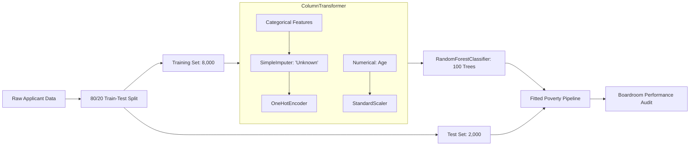

# 🇳🇬 Nigeria Poverty Alleviation Grant Predictor
> **End-to-End Machine Learning Pipeline & Public Policy Risk Audit**

[](https://www.python.org/)
[](https://scikit-learn.org/)
[](https://pandas.pydata.org/)
[]()

---

## 📌 Executive Summary

As part of a national humanitarian initiative, the **Ministry of Humanitarian Affairs** sought to optimize the distribution of poverty alleviation grants across 10,000 recorded individuals in Nigeria. 

This project acts as an end-to-end data science and machine learning solution that automates grant eligibility classification while minimizing critical policy risks—specifically, **false negatives (failing to identify families living below the poverty line)** vs. **false positives (misallocating public funds)**.

---

## 🎯 Business Mission & Objectives

1. **Diagnostic Data Quality Audit**: Handle missing socio-economic indicators across 10,000 individual records without compromising statistical validity.
2. **Visual Storytelling & Policy Insights**: Provide clear visual evidence for stakeholders regarding key drivers of poverty (e.g., educational attainment).
3. **Leakage-Free Machine Learning Architecture**: Design a robust `scikit-learn` preprocessing and classification pipeline.
4. **Risk-Aware Model Evaluation**: Audit model performance via a boardroom confusion matrix, prioritizing safety-net coverage (Recall) for vulnerable populations.
5. **Production Inference Engine**: Provide an API-ready interface for predicting grant eligibility for new applicants.

---

## 📊 Exploratory Data Analysis & Policy Insights

### Dataset Features (10,000 Records)
* **Demographics**: `Individual_ID`, `Age`, `Gender`, `Region` (North East, North West, South East, South West, etc.), `Location` (Urban / Rural).
* **Socio-Economic Factors**: `Education_Level` (Primary, Secondary, Tertiary, NaN), `Occupation`, `Employment_Type`, `Monthly_Income_NGN`.
* **Target Variable**: `Poverty_Status` (`1`: In Poverty / Grant Eligible, `0`: Safe / Ineligible).

### Key Findings
* **Missing Data Challenge**: 3,996 records possessed missing `Education_Level` entries. Rather than dropping ~40% of the dataset, missing values were imputed with an explicit `"Unknown"` category to maintain data volume and model integrity.
* **Education vs. Poverty Correlation**: Exploratory analysis confirmed that poverty rates drop sharply as educational levels rise, establishing tertiary education as a primary structural buffer against poverty.

```
Poverty Rate by Education Level:
┌─────────────────┬─────────────────┐
│ Primary         │ ████████████░   │ High Rate
│ Secondary       │ ████████░░░░░   │ Moderate Rate
│ Unknown         │ ███████░░░░░░   │ Moderate Rate
│ Tertiary        │ █░░░░░░░░░░░░   │ Very Low Rate
└─────────────────┴─────────────────┘
```

---

## ⚙️ Machine Learning Pipeline Architecture

To prevent **data leakage** between training ($80\%$) and testing ($20\%$) sets, all transformations are encapsulated inside an end-to-end `scikit-learn` `Pipeline`.



---

## 📈 Model Performance & Business Risk Audit

The pipeline was evaluated on a held-out test set of 2,000 unseen applicant profiles.

### Classification Report

| Category | Precision | Recall | F1-Score | Support |
| :--- | :---: | :---: | :---: | :---: |
| **Safe (0)** | 0.67 | 0.63 | 0.65 | 535 |
| **In Poverty (1)** | **0.87** | **0.89** | **0.88** | 1,465 |
| **Overall Accuracy** | — | — | **82%** | 2,000 |

### Boardroom Confusion Risk Matrix

| | Predicted: Safe (Deny) | Predicted: In Poverty (Approve) | Public Policy Impact |
| :--- | :---: | :---: | :--- |
| **Actual: Safe** | **336** (TN) | 199 (FP) | *False Positive*: Wasted Grant Allocation |
| **Actual: In Poverty** | 167 (FN) | **1,298** (TP) | *False Negative*: **Missed Vulnerable Household** |

> [!IMPORTANT]
> **Policy Strategic Choice**: The model prioritizes a **High Recall (89%)** for citizens living in poverty. In a humanitarian context, the societal cost of leaving an impoverished family without aid (False Negative) far outweighs the administrative cost of a grant false alarm (False Positive).

---

## 💻 Production Inference Engine

The pipeline allows real-time inference on new grant applications without requiring manual preprocessing:

```python
import pandas as pd

# Define a new applicant profile
new_applicant = pd.DataFrame({
    'Age': [44],
    'Gender': ['Female'],
    'Region': ['North West'],
    'Location': ['Urban'],
    'Education_Level': ['Tertiary'],
    'Employment_Type': ['Wage-employed']
})

# Predict grant eligibility directly via fitted pipeline
prediction = poverty_pipeline.predict(new_applicant)
decision = "APPROVE" if prediction[0] == 1 else "DENY"

print(f"Grant Application Decision: {decision}")
# Output: Grant Application Decision: DENY
```

---

## 📁 Repository Structure

```gfm
Poverty-Aleviation-Project-Python/
├── README.md                     # Executive Portfolio Documentation
├── End to End Project 2.ipynb     # Complete Data Science & ML Jupyter Notebook
└── nigeria_economic_data.csv     # Benchmark Socio-Economic Dataset (10,000 rows)
```

---

## 🚀 Getting Started

### 1. Prerequisites
Ensure Python 3.8+ is installed along with standard data science packages:

```bash
pip install pandas numpy matplotlib seaborn scikit-learn
```

### 2. Clone & Launch
```bash
git clone https://github.com/iPablo26/Poverty-Aleviation-Project-Python.git
cd Poverty-Aleviation-Project-Python
jupyter notebook "End to End Project 2.ipynb"
```

---

## 🤝 Contact & Portfolio

Developed as part of a Data Science & Machine Learning portfolio project for public policy applications. Feel free to reach out or contribute via Pull Requests!
